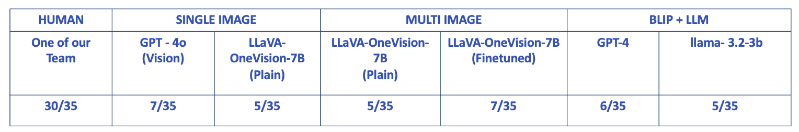

# YAIQ
#### YAICON 5th Multimodal Team🌟 from [YAI](https://github.com/yonsei-YAI)

---

## Overview

This repository presents our work in solving visual IQ tests using multimodal models, including fine-tuning and evaluation processes on **LLaVA-OneVision** and **CLIP + LLM** architectures. Our methods and experiments are benchmarked on the MENSA-NORWAY dataset.

---

## 1. Fine-Tuning LLaVA-OneVision

We utilized the [lmms-finetune](https://github.com/zjysteven/lmms-finetune) repository for fine-tuning **LLaVA-OneVision**.  
A huge thanks to the contributors of this awesome repo! 🙌

---

## 2. Fine-Tuning CLIP

*TBD*

---

## 3. Evaluation on MENSA-NORWAY

Our models were evaluated on the **MENSA-NORWAY Visual IQ Test**, a dataset available [here](https://huggingface.co/datasets/eduardtoni/MENSA-visual-iq-test).

### 3.1. Evaluation in LLaVA-OneVision

Run the following command to evaluate LLaVA-OneVision:

```bash
python evaluation/llava_evaluation.py \
    --mode peft \ # or default
    --cache_dir /path/to/cache \ # path to HF model (local) or FT model
    --original_model llava-hf/llava-onevision-qwen2-7b-ov-hf \ # ID of the original model
    --dataset_path /path/to/dataset \ # path to the dataset
    --prompt_path /path/to/prompt.json \ # path to your prompt JSON
    --image_dir /path/to/images \ # path to image data
    --output_path /path/to/save/results.json # path to output
```

### 3.2. Evaluation in CLIP + LLM

*TBD*

---

## 4. Results



---

## 5. References & More

1. Li, Bo and Zhang, Yuanhan and Guo, Dong and Zhang, Renrui and Li, Feng and Zhang, Hao and Zhang, Kaichen and Li, Yanwei and Liu, Ziwei and Li, Chunyuan, **LLaVA-OneVision: Easy Visual Task Transfer**, *arXiv preprint arXiv:2408.03326*, 2024. 


For additional insights into AI performance on IQ tests, visit [Tracking AI - IQ Test](https://trackingai.org/IQ)

---

